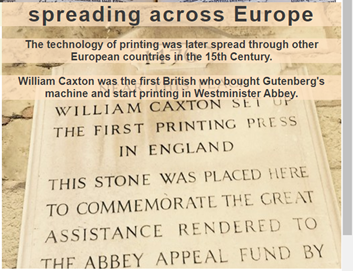
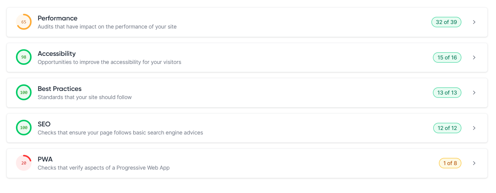

 
 
Gutenberg and Publishing is a historical website for general publics to know about the history of printing and the biography of Johannes Gutenberg.

Users can navigate through the website to look for biography, historical timeline, and gallery. The site targets students and other general public who would like to know more about the history of printing.

<h1>Features</h1>

<h1>Navigation and The Header</h1>

<ul>
<li>The Logo of the page is located at the top left corner of the page, using a Blackletter font of UnifrakturMaguntia to match the historical setting of the theme.</li>

<li>There are three navigation links at the top right corner of the page which are Home, Gallery, and Timeline which links to different section of the page. Each link is designed with their respective icon. </li>

<li>The design of navigation not only conveys the structure of the page clearly to the user, but also arouses their interest to serve and learn about the theme.</li>
</ul>

<h1>The printing-outer section</h1>

<ul>
<li>The printing-outer section use a photo of type pieces to set out the theme of printing history.</li>

<li>The Header uses a font colour of white to bring out the contrast when explaining the website is a historical website about Johannes Gutenberg and Printing.</li>
</ul>

<h1>The Biographical-information section</h1>

<ul>
<li>The Biographical-information section provides a brief summary of Johannes Gutenberg’s life, with his date and place of birth, and the time when he starts inventing.</li>

<li>The Biographical-information section also outlines the Invention and Legacy of Johannes Gutenberg.</li>

<li>Next to each paragraph, relevant photos are placed to add information and evidence about the appearance, invention and publication of Gutenberg for users’ reference.</li>

<li>The Biographical-information section uses Oxford-Blue (#002147) as background colour to match with the classical theme of printing history.</li>
</ul>

<h1>The Map-Location section</h1>  

<ul>
<li>The Map-Location gives details of Gutenberg Museum in Mainz Germany by embedding a Google map at the left of the section.</li>

<li>A photo of the museum is located as background of the section to provide extra information.</li>

<li>Above the map and photo, there is a call for action by recommending the users to visit the museum with a link to the gutenberg museum.</li>
</ul>

<h1>The Footer</h1> 

<ul>
<li>The Footer encourages readers to contact the page by social media.</li>
</ul>

<h1>Gallery page</h1>

<ul>

<li>Insert photos and portrayal of Gutenberg’s machine and other important figures.</li>

<li>Insert YouTube video to demonstrate how the printing machine works</li>
<ul>

<h1>Timeline page</h1>

<ul>
<li>Insert photos and interactive element by setting mouse hover animation using css.</li>
<li>plotting the timeline of Gutenberg's invention and its influence in chronological order.</li>
</ul>

<h2>hover effect as follow (before and after)</h2>
 

<h1>Testing</h1>

<h1>Bugs</h1>
<ul>
<li>I discover that when I deploy my website to Github, some photos can not be display</li>
<li>After discussing with tutor, I discover that it was because I have use absolute pathway when citing them from the assets folder</li>
<li>Example would be the starting slash before assets in "/assets/image/" in the img element.</li>
</ul>

<h1>Validation Testing</h1>
<ul>
<li>HTML: No error was found using official W3C Validator.
</li>
<li>CSS: No error was found using official W3C Validator.
</li>
<li>Accesssibility: I confirm colors and fonts chosen are easy to read and accessible by running it through lighthouse in devtools. </li>
</ul>

<h1>Deployment</h1>

<ul>
The page is deployed to github page, following the below steps.
<li>Navigate to setting in Github page</li>
<li>Select page and select main branch from the dropdown menu</li>
<li>Once the link is deployed, the link is generated in Github page.</li>

</ul>

The link is here <a href="https://holaw77.github.io/CI-Portfolio-Project-1/">Gutenberg and Printing</a>

<h1>Credit</h1>

<h2>Content</h2>

The Code to make social media link and gallery page were taken from the CI <a href="https://github.com/Code-Institute-Solutions/love-running-2.0-sourcecode/tree/main/08-responsive-elements/05-responsive-gallery">Love Running Project</a>

The biographical information of Johannes Gutenberg in Biographical-information section and time-line.html were from the below sources:

Winship, George Parker, Gutenberg to Plantin: An Outline of The Early History of Printing, Cambridge: Harvard University Press, 1926. 

M. Sophia Newman, “So, Gutenberg Didn’t Actually Invent Printing As We Know It
On the Unsung Chinese and Korean History of Movable Type”, June 19, 2019, Literary Hub, https://lithub.com/so-gutenberg-didnt-actually-invent-the-printing-press/

History.com editors, “Printing Press- History”, May 7, 2018, History.com, https://www.history.com/topics/inventions/printing-press#:~:text=Goldsmith%20and%20inventor%20Johannes%20Gutenberg,use%20commercially%3A%20The%20Gutenberg%20press.

<h2>Media</h2>

<h3>Icons are from font-awesome</h3> 
<a href="https://fontawesome.com/">https://fontawesome.com/</a>

<h3>The Lato and UnifrakturMaguntia fonts are from Google fonts</h3>
<a href="https://fonts.google.com/share?selection.family=Lato:wght@300%7CUnifrakturMaguntia">https://fonts.google.com/share?selection.family=Lato:wght@300%7CUnifrakturMaguntia</a>

<h3>YouTube video</h3>
Timeline, “The Medieval History that Changed the Course of History: The Machine that made us”, Timeline: World History Documentary, 25 Aug 2018, YouTube, <a href="https://www.youtube.com/watch?v=uQ88yC35NjI&t=1835s">https://www.youtube.com/watch?v=uQ88yC35NjI&t=1835s</a>.

<h2>Photos reference</h2>

<h3>Index.html</h3>

https://upload.wikimedia.org/wikipedia/commons/thumb/a/ae/Metal_movable_type.jpg/220px-Metal_movable_type.jpg

https://upload.wikimedia.org/wikipedia/commons/3/33/Gutenberg.jpg

https://ak.picdn.net/shutterstock/videos/1059690029/thumb/1.jpg?ip=x480

https://www.google.com/url?sa=i&url=https%3A%2F%2Fwww.historyofinformation.com%2Fdetail.php%3Fid%3D292&psig=AOvVaw1lJI6ExXDMC9__5b85PZgh&ust=1672152447194000&source=images&cd=vfe&ved=0CA8QjRxqFwoTCNDK3rrDl_wCFQAAAAAdAAAAABAN

https://www.google.com/url?sa=i&url=https%3A%2F%2Fwww.maxpixel.net%2FSachsen-Good-Mountain-Museum-Germany-Europe-Mainz-2336308&psig=AOvVaw0BMnVwAMuvrxoa9KiJgsct&ust=1672152678177000&source=images&cd=vfe&ved=0CA8QjRxqFwoTCJCE7aXEl_wCFQAAAAAdAAAAABAD

https://www.google.com/url?sa=i&url=https%3A%2F%2Fcommons.wikimedia.org%2Fwiki%2FFile%3AAltbau_Zum_R%25C3%25B6mischen_Kaiser_des_Gutenberg-Museums.jpg&psig=AOvVaw2X3T4BS5LilTBzq2z92i9A&ust=1673171543514000&source=images&cd=vfe&ved=0CAwQjRxqFwoTCMi81_KXtfwCFQAAAAAdAAAAABAD

<h3>Gallery.html:</h3>

https://www.history.com/.image/t_share/MTU3ODc5MDg2NDM0NzU1OTEz/printing-press-2.jpg

https://encrypted-tbn0.gstatic.com/images?q=tbn:ANd9GcRXUuFpgDX5RVZ5LdJ0c30XqxQhpXz_ifi97w&usqp=CAU

<h3>time-line.html</h3>

https://t4.ftcdn.net/jpg/01/17/04/01/240_F_117040176_ZoHPL9kEFM33RAqCuWNMBASk6SYgEBtd.jpg

https://cdn.britannica.com/70/74370-050-07DC0A6E/artist-visualization-workshop-proof-Johannes-Gutenberg-sheet.jpg

https://thumbs.dreamstime.com/b/historic-gutenberg-bible-as-displayed-historic-washington-dc-glimpse-history-christianity-first-bible-108964909.jpg 

https://upload.wikimedia.org/wikipedia/commons/8/80/Catholicon1499.jpg

https://upload.wikimedia.org/wikipedia/commons/f/fe/Sch%C3%B6ffer_%26_Fust_trademark00.jpg

https://www.flickr.com/photos/shakespearesmonkey/16856130892

<h3>Row and column setting is from bootstrap grid </h3>

https://cdn.jsdelivr.net/npm/bootstrap@5.1.3/dist/css/bootstrap.min.css